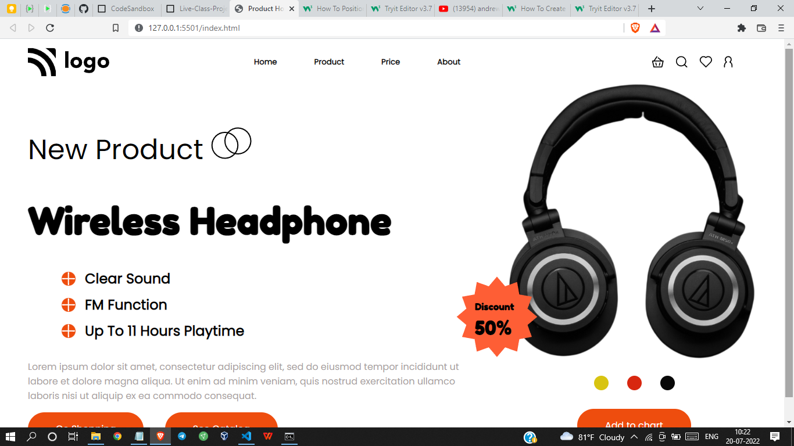

# Project 7 - HTML  and CSS 

By Shreesha

Here's the Live Deployed Website of 

## Project 07  [DEPLOYED LINK](https://project07-product-home-page.netlify.app/)

# What did I learn in this project

- I got to learn about the   positioning of images in depth.
- Got to learn about the flexbox.
- got to learn how to design buttons.

## Time taken to complete project is 4 hours
